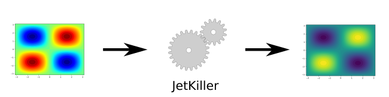

# Jet Killer

Jet Killer is a plugin for [GIMP](https://www.gimp.org/) which converts images 
using the "jet" colormap to a better one (by default "viridis") by using 
directly the pixel values, without any knowledge about the underlying
data.

It can be used as a tool to enhance data visualizations for which
the original dataset is unavailable. Use cases include:

* enhancing figures from sources who made an unfortunate
  colormap choice,
* enhancing graphs for which the original data may be lost,
* enhancing visualizations without having to regenerate it from the
  original dataset.
  

## Installation

If you do not have GIMP installed, you will need to install it. Instructions are 
available on the [officiel website](https://www.gimp.org/downloads/). 

Once you have a working installation, install the plugin by following the 
procedure for Python plugins explained on 
[this page](https://en.wikibooks.org/wiki/GIMP/Installing_Plugins).

The plugin has some dependencies that might not be included with GIMP:

* matplotlib,
* numpy.

## Usage

In GIMP, Jet Killer can be found under *Filters > Enhance > Jet Killer*.

The popup dialog let you choose the output colormap for the processing. The input
colormap is always supposed to be `jet`.

You can launch the processing by clicking on the right button, or close
the plugin with the left button. You can of course also close the plugin by
closing the dialog.

The active layer is taken as input and the output is written to a new layer.

If you have an active selection, only the selected area is processed and
the rest is ignored. This can be useful to left axes or titles unchanged. If you
do not have an active selection, the entire layer is processed.

## Release History

All releases of this project are listed on the tag page of this
repository.

See [CHANGELOG.md](CHANGELOG.md) for more details on the content of each release.

## Versioning

Jet Killer attempts to follow the [Semantic Versioning
Specification](https://semver.org/spec/v2.0.0.html) for its version
numbers.

## License

Jet Killer is distributed under the MIT License. See
[LICENSE-MIT](LICENSE-MIT) for more details.
